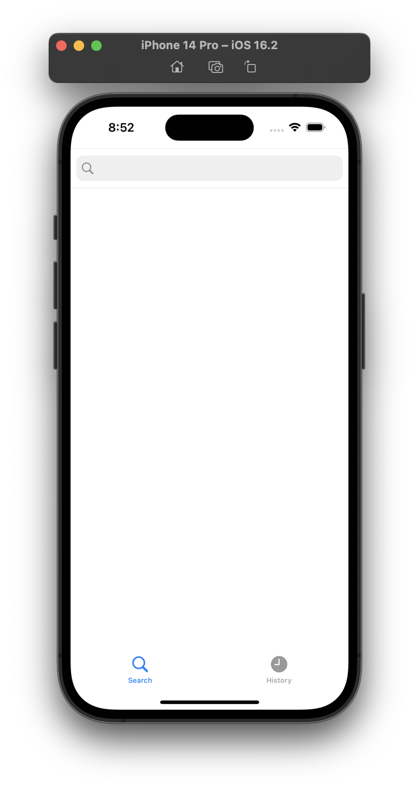
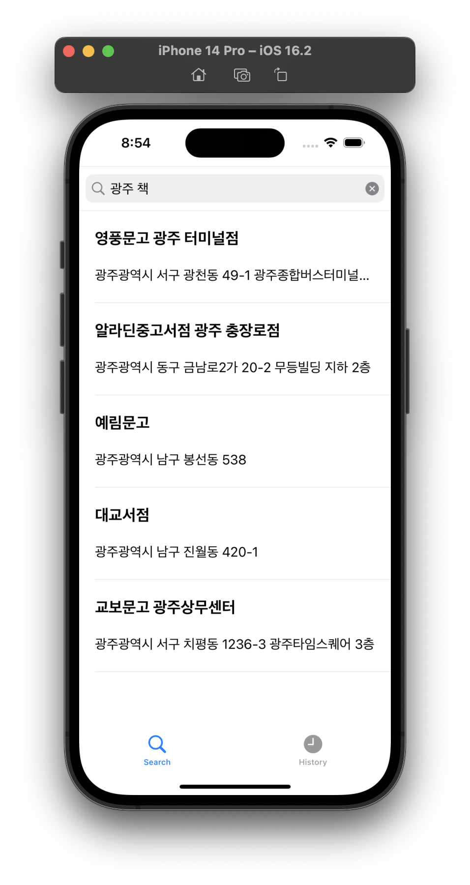
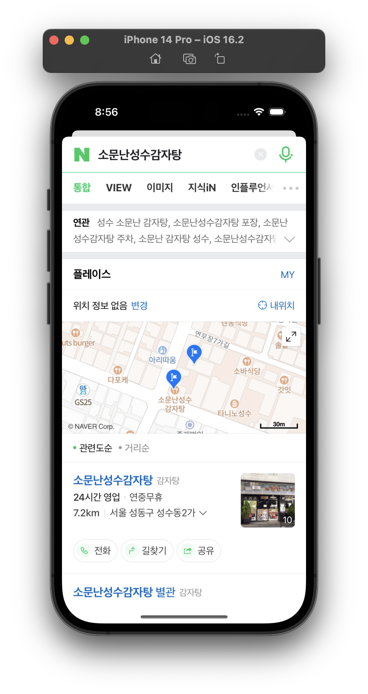
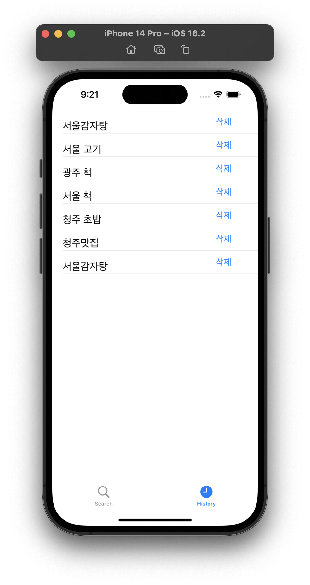

# ios_WebView
---
## 프로젝트 목적
* webView를 학습하기 위한 프로젝트입니다.  
* naverSearchAPI를 사용하였으며 검색어를 입력받고 나온 결과에 대한 webView를 띄워주도록 하였습니다. 또한 firebase를 사용하여 검색한 키워드를 저장하도록 하였습니다.
---
## 프로젝트 설명
* 사용기술


  
  
* 개발환경


   
 
* 기능설명  


  * 검색창에 원하는 지역과 키워드를 검색할 수 있습니다.
  * 검색 목록을 선택하여 네이버 웹뷰를 볼 수 있습니다.
  * History 탭바를 통해 과거 검색했던 내용을 볼 수 있습니다.
  
        

 * 프로젝트 구조  

<table>
<tbody>

<tr>
    <td><b>ViewController.swift</b></td>
<td> searchBar에 관련한 내용, 테이블 뷰 구성과 URLSession을 이용하여 데이터를 요청하고 받아오는 부분으로 이루어져 있습니다.</td>
</tr>

<tr>
    <td><b>DataModel.swift</b></td>
<td>DTO 파일입니다.</td>
</tr>

<tr>
    <td><b>tableCell.swift</b></td>
<td>검색 뷰의 TableViewcell을 구성하기 위한 컴포넌트 아울렛이 연결되어 있는 부분입니다.</td>
</tr>

<tr>
    <td><b>DetailVC.swift</b></td>
<td>웹뷰를 위한 아울렛이 연결되어있는 부분입니다.</td>
</tr>

<tr>
    <td><b>HistoryViewController.swift</b></td>
<td>Histroy뷰를 만들기 위해 데이터베이스를 사용하는 부분입니다.</td>
</tr>  

<tr>
    <td><b>DetailVC.storyboard</b></td>
<td>웹뷰를 띄우기 위한 storyboard입니다.</td>
</tr>

<tr>
    <td><b>Main.storyboard</b></td>
<td>TabBarController를 사용하여 검색화면과 히스토리 화면을 구성한 storyboard입니다. </td>
</tr>


</tbody>
</table>

* 실행방법  
```
1. Clone this repository.
2. Run Xcode and excute project.
```
